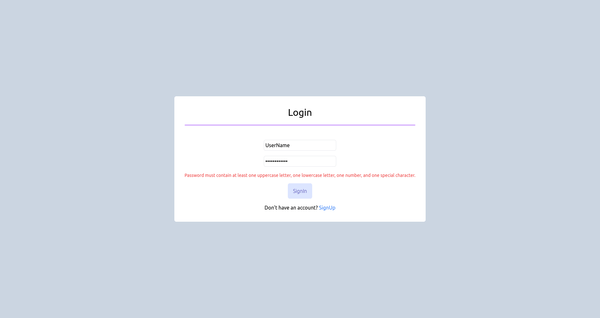

# Brainsily Frontend Documentation

This is the frontend documentation for the **Brainsily** project, a practice project focused on creating an intuitive content management dashboard. The frontend is built with React, TypeScript, TailwindCSS, and Vite.

For the backend source, please refer to [WebDev/Proj-Week-15-Brainsily-be](../Proj-Week-15-Brainsily-be/)

---

## **Table of Contents**

1. [Project Overview](#project-overview)
2. [Tech Stack](#tech-stack)
3. [Setup Instructions](#setup-instructions)
4. [Available Scripts](#available-scripts)
5. [Features](#features)
6. [Acknowledgements](#acknowledgements)
7. [Screenshots](#screenshots)

---

## **Project Overview**

Brainsily is a single-page application designed to help users manage and share content. It features a seamless user experience with routing, form handling, and interactive dashboards. 

This is a **practice project**, and the primary focus is on:
- Strengthening frontend development skills.
- Utilizing modern technologies like React, TypeScript, and TailwindCSS.
- Implementing modular and scalable project structures.

---

## **Tech Stack**

- React 18.3.1
- React Router DOM 7.1.1
- TypeScript 5.7.2
- TailwindCSS 3.4.17
- Axios 1.7.9
- Vite 6.0.3
- Zod (for runtime validation)

---

## **Setup Instructions**

### Prerequisites
Ensure you have the following installed:
- Node.js (version 16 or higher)
- npm or yarn

### Steps

1. Clone the repository:
   ```bash
   git clone https://github.com/tsMukesh51/WebDev.git
   cd .../week-15-brainsily-fe
   ```

2. Install dependencies:
   ```bash
   npm install
   # or
   yarn install
   ```

3. Run the development server:
   ```bash
   npm run dev
   # or
   yarn dev
   ```

4. Open the application in your browser at `http://localhost:5173`.

---

## **Available Scripts**

### **`npm run dev`**
Runs the app in development mode using Vite. The browser will automatically reload for any changes.

### **`npm run build`**
Builds the app for production. The build artifacts will be output to the `dist` folder.

### **`npm run preview`**
Previews the production build locally.

---

## **Features**

- **Welcome Page**: A warm introduction to the application.
- **Signup & Login**: Authentication system to create or access user accounts.
- **Dashboard**: A content management interface allowing users to create, view, and manage their content.
  - Add new content with various `contentFormat` types (e.g., text, tweet, YouTube video, link).
  - Select and filter content based on type.

---

## **Acknowledgements**

Special thanks to my mentor **[Kirat](https://github.com/hkirat)** for guiding me through initial stages of this project and helping me understand the principles of frontend development.

---

## **Screenshots**

1. **Welcome Page**
   

2. **Login Page**
   

3. **Dashboard Overview**
   

4. **Adding New Content**
   

5. **Selecting a Content Type**
   

---

<!-- ## **License**
This project currently does not have a license. If you'd like to add one, consider reviewing the [Open Source Initiative](https://opensource.org/licenses) to select a suitable license for your project. -->

